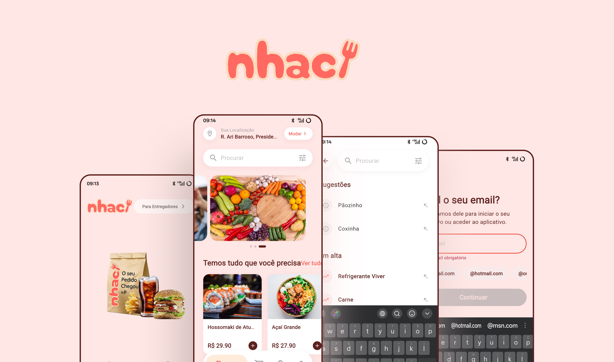

## Sobre o Projeto

O Nhac é um aplicativo com a proposta de ser um delivery simples e prático[cite: 2]. Este projeto foi desenvolvido como Trabalho de Conclusão de Curso (TCC) com o objetivo de entregar uma experiência fluida de pedidos de comida, englobando desde a escolha do prato até a finalização do pagamento e acompanhamento do status do pedido.

O design da interface e a construção da marca foram cuidadosamente planejados para refletir a identidade visual do Nhac. Você pode conferir todo o processo criativo, manual da marca e especificações de interface diretamente no projeto desenvolvido no Figma:

* [Acessar o Projeto Nhac e Manual da Marca no Figma](https://www.figma.com/design/VEpDtQ9u5xsytcx7K7M0sU/Projeto-Nhac?node-id=0-1&t=RadYcYtwipyF9VR9-1)

## Demonstração Visual

Abaixo estão algumas capturas de tela demonstrando o fluxo principal e a interface do aplicativo:

| Bem-vindo | Tela Inicial | Localização |
|:---:|:---:|:---:|
| <video src="./readme/bem-vindo.mp4" autoplay loop muted playsinline width="250"></video> | <video src="./readme/tela-inicial.mp4" autoplay loop muted playsinline width="250"></video> | <video src="./readme/localizacao.mp4" autoplay loop muted playsinline width="250"></video> |

## Tecnologias e Dependências

O aplicativo foi construído utilizando o framework Flutter, com suporte para o SDK na versão 3.2.0 ou superior[cite: 2]. A arquitetura do projeto faz uso de bibliotecas robustas para garantir performance, segurança e uma boa manutenção do código. 

As principais tecnologias e pacotes utilizados incluem:

* **Ecossistema Firebase:** Utilizado para os serviços de backend, incluindo autenticação de usuários (`firebase_auth`), banco de dados em nuvem (`cloud_firestore`), armazenamento (`firebase_storage`) e sistema de notificações (`firebase_messaging`)[cite: 2].
* **Gerenciamento de Estado e Rotas:** Controle de estado realizado através do `provider` e navegação estruturada utilizando o `go_router`[cite: 2].
* **Comunicação de Rede:** Requisições HTTP e consumo de APIs externas gerenciados pelo pacote `dio`[cite: 2].
* **Geolocalização e Mapas:** Ferramentas para captura de coordenadas (`geolocator`) e conversão de endereços físicos (`geocoding`)[cite: 2].
* **Segurança e Autenticação:** Armazenamento encriptado de dados sensíveis com `flutter_secure_storage` e validação biométrica/local com `local_auth`[cite: 2].
* **Monitoramento:** Integração com o Sentry (`sentry_flutter`) para rastreamento de erros e monitoramento de desempenho em ambiente de produção[cite: 2].
* **Pagamentos:** Integração de fluxo financeiro gerenciada através do pacote `pay`[cite: 2].
* **Variáveis de Ambiente:** Gerenciamento seguro de credenciais e chaves de API utilizando o pacote `flutter_dotenv`[cite: 2].

## Como Executar o Projeto

Siga os passos abaixo para testar o aplicativo em seu ambiente de desenvolvimento local. É necessário ter o ambiente Flutter configurado na sua máquina.

1. **Clone este repositório**
   Abra o seu terminal e execute:
   ```bash
   git clone [https://github.com/feentzs/Nhac.git](https://github.com/feentzs/Nhac.git)
   cd Nhac
   ```

2. **Instale as dependências**
   Baixe todos os pacotes necessários do projeto listados no seu arquivo de configuração[cite: 2]:
   ```bash
   flutter pub get
   ```

3. **Configuração de Variáveis de Ambiente**
   O projeto utiliza o pacote `flutter_dotenv` e um arquivo oculto `.env` declarado nos assets para gerenciar as chaves de API de forma segura[cite: 2]. 
   Na raiz do projeto, crie um arquivo chamado `.env` e baseando-se no arquivo `env.example`, insira a chave necessária seguindo o formato[cite: 1]:
   ```env
   GOOGLE_API_KEY=chave_do_places_aqui
   ```

4. **Execute o aplicativo**
   Conecte um emulador ou um dispositivo físico via cabo/Wi-Fi e execute o comando:
   ```bash
   flutter run
   ```